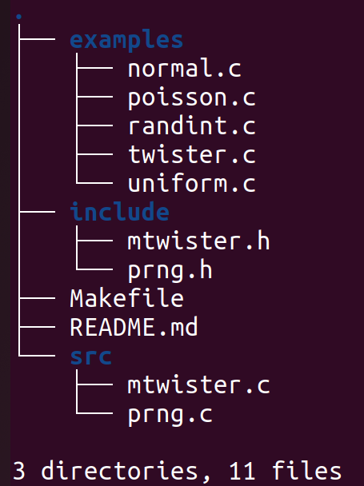

# Pseudo Random Number Generator (PRNG)

# Description
A unique function can be used to initialize the generator

```c
prng * prng_init(const unsigned long seed);
```

It takes a seed as argument and returns a pointer of struct prng defined as bellow

```c
struct prng {
    const unsigned long seed;
    
    ...    
};
```
N.B: _if seed=0 then the system time is used otherwise the seed is obtained from /dev/urandom_.

A set of functions are defined to deal with the created struct prng:
- The _set_seed_ function to set/update the default seed.

```c
void (*set_seed)(prng * prng, const unsigned long s);
```

- The _randint_ function to get random integers.

```c
unsigned long (*randint)(prng * prng);
```

- The _uniform1, uniform2, uniform3_ functions to get random numbers in different ranges from 0 to 1.

```c
double (*uniform1)(prng * prng);
double (*uniform2)(prng * prng);
double (*uniform3)(prng * prng);
```

For example the second function gives random numbers from [0, 1).

- The _normal_ function to get random numbers from a Gaussian distribution defined by $\mu$ and $\sigma$

```c
double (*normal)(prng * prng,
            const double mu, const double sigma);
```

- The _poisson_ function to get random numbers from a Poisson distribution defined by a single parameter $\lambda$

```c
double (*poisson)(prng * prng,
            const double lambda);
```

_N.B: Two algorithms are used to get a poisson number depending of the value of the parameter $\lambda$. So, if $\lambda \lt 30$ then the knuth algorithm is used (see https://fr.wikipedia.org/wiki/Loi_de_Poisson) else the cook one is used (see https://www.johndcook.com/blog/2010/06/14/generating-poisson-random-values/)._

- The _weight_ function to get the weight of the last distribution that is used

```c
double (*weight)(prng * prng);
```

- The _destroy_ function to free allocated memory from the created prng.

```c
void (*destroy)(prng ** self_ptr);
```

# Structure
The repository contains the following files and folders


# Build
To build the _prng_ library, execute in the terminal, in the main directory, the following

```bash
make prng
```

# Examples
The directory _examples_ contains different examples. To compile these examples, execute in the terminal the following

```bash
make examples
```

# Clean
As usual, use the following to clean up the build

```bash
make clean
```
